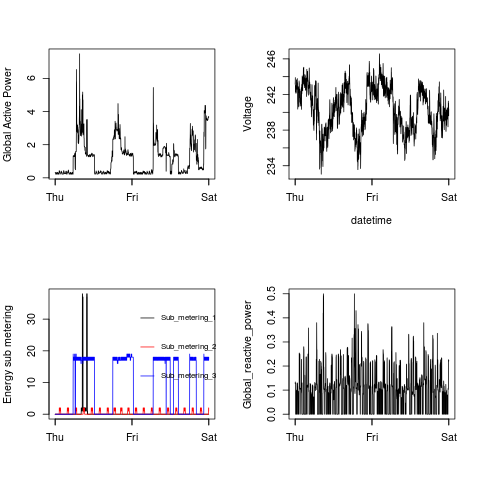

## Background

This repository contains the 4 R scripts submitted in fulfillment of Assignment 1 of the COURSERA Exploratory Data Analysis Course. 

These scripts examine how household energy usage varies over a 2-day period in February, 2007 using data from the <a href="http://archive.ics.uci.edu/ml/">UC Irvine Machine
Learning Repository</a>, a popular repository for machine learning datasets. The data set used for the assignment concerns the "Individual household electric power consumption Data Set" which is available on the course web site in zip format:

* <b>Dataset</b>: <a href="https://d396qusza40orc.cloudfront.net/exdata%2Fdata%2Fhousehold_power_consumption.zip">Electric power consumption</a> [20Mb]
 
The repository also contains the output produced by these scripts in the folder named: 'figure'

## The R scripts
 
There are 4 scripts:

*  plot1.R

This script produces an histogram of the Global Active Power comsumption in kilowatts. 

The script outputs the plot to a PNG file in the sub-directory 'figure' in the current-working directory as: plot1.png

*  plot2.R

This script plots a line graph of the Global Active Power comsumption in kilowatts over the two-day period of 1 Feb 2007 and 2 Feb 2007. 

The script outputs the plot to a PNG file in the sub-directory 'figure' in the current-working directory as: plot2.png

*  plot3.R

This script plots the 3 types of Energy Sub-metering for the  two-day period of 1 Feb 2007 and 2 Feb 2007. 

The script outputs the plot to a PNG file in the sub-directory 'figure' in the current-working directory as: plot3.png

*  plot4.R

This script produces 4 plots over the two-day period of 1 Feb 2007 and 2 Feb 2007: 
           -  plot of Global Active Power comsumption
           -  plot of Voltage 
           -  plot of Energy Sub-metering
           -  plot of Global Re-active Power comsumption
           
The script outputs the plot to a PNG file in the sub-directory 'figure' in the current-working directory as: plot4.png

## Running the scripts

Download the scripts into your working directory. Download the zip data file from the link provided above and unzip the contents in a sub-directory named 'data' in you current working directory.

Each script can be run independently and in any sequence. Each script produces its own output file as described above.

These scripts are written to run on a system running Linux. If you are using any other system such as Windows or Mac, you may need to make appropriate changes to Graphics Device calls. 

## The Plots

The plots produced by the scripts and found in the 'figure' folder are displayed below:

### Plot 1

 

### Plot 2

 

### Plot 3

 

### Plot 4

 

